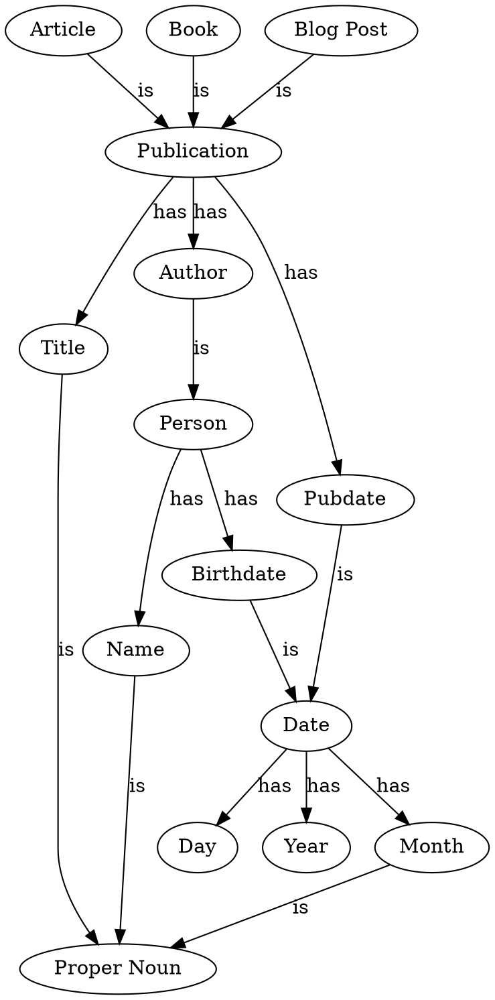

Knowledge Graph
===============

Learning Outcomes
-----------------

After completing this lab, student will be able to:

- Describe relationships between statements to form a knowledge graph
- Represent a graph using graphviz
- Build a small ontology covering a domain of interest

Assignment
----------

Select a domain of interest and create a small [knowledge graph](https://en.wikipedia.org/wiki/Knowledge_graph) demonstrating how entities in this domain are connected. Here short example for publications:

You should use graphviz to document your relationships and build a graph. You may use graphviz via the CLI, any GUI you choose, or [free hosted web tools](https://dreampuf.github.io/GraphvizOnline/?engine=dot).

Here is the above graph in graphviz:

Requirements
------------

Your graph should include at least the following:

- 20 entities
- 25 relationships between entities
